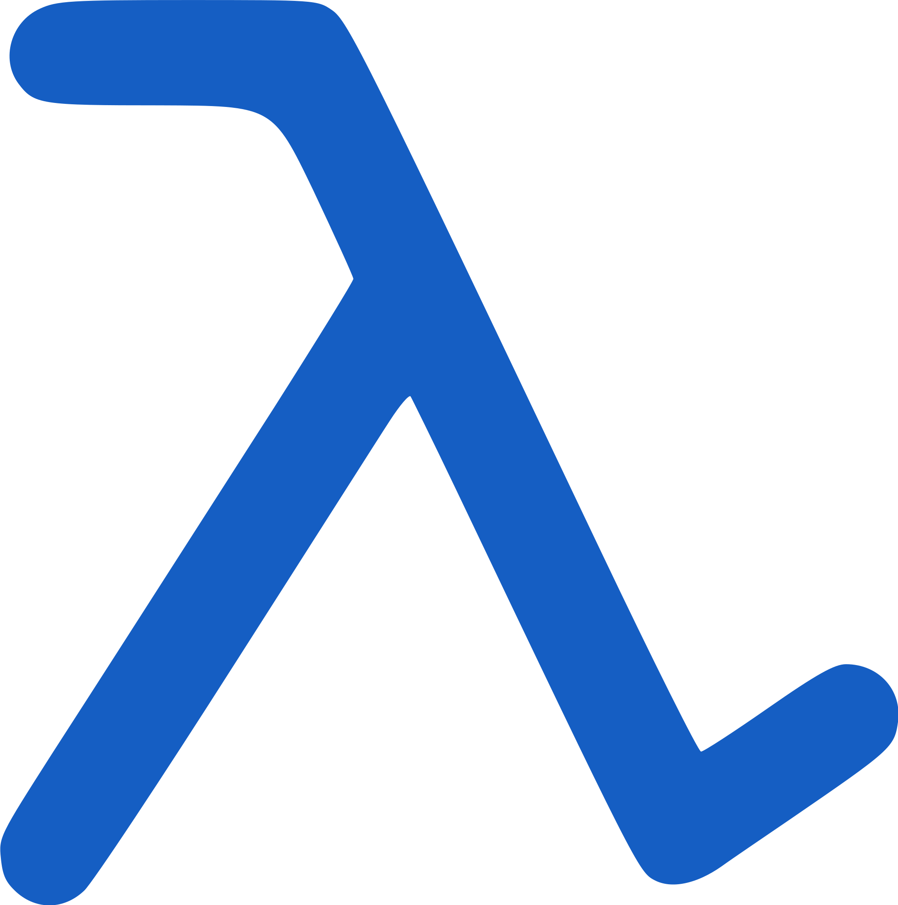

#  Dak

Dak is a Lisp like language that transpiles to JavaScript.

<!--exits-->

## Play

If you want to jump in and see what it looks like, explore the
[Dak Tour](https://www.daklang.com/tour/).

## Zen

1. Full access to JavaScript. Be one with the host.
2. No runtime. Participate in the ecosystem.
3. Perfect is the enemy of good. Versions are infinite.
4. Be useful today. Survive to thrive.
5. Be fast. Stay fast.

JavaScript is ubiquitous. It's ecosystem is diverse and populated. Dak attempts
to provide a path to leverage and participate in this ecosystem, as a modern
lisp like language. It is not a Lisp. It's still JavaScript, but wearing a Lisp
outfit. It's not Common Lisp or Scheme, but a bit more like Clojure or Fennel.
It doesn't hide it's true nature, and aims to provide access to every feature
JavaScript has.

[Macros](https://www.daklang.com/tour/macros/) and the programmable aspects of
Dak are what I consider to be it's selling points. It's much easier to achieve
this in a Lisp like language. These are still very much a work-in-progress.
Expect heavy iteration here.

Syntax in JavaScript is quite diverse. Much of it is already supported. What is
missing is probably easy to provide.

## Bun?

Dak is written with [Bun](https://bun.sh/) in mind, not
[Node](https://nodejs.org/). This was not always the case, and will not
always be the case. Dak is JavaScript.
